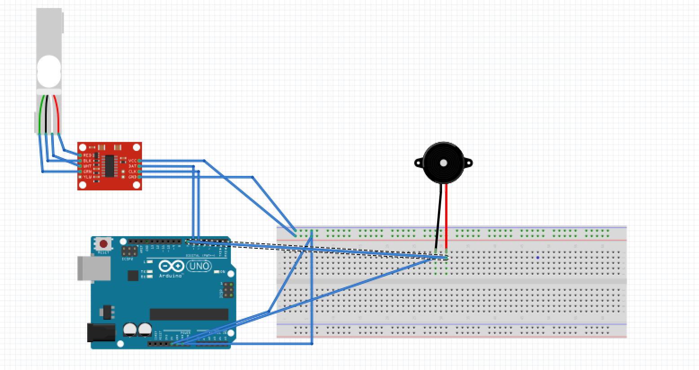

# P00: Water Checker

**Author(s)**: Tobi & Lakshiya

**Google Document**: https://docs.google.com/document/d/1iizkFOpGYiZkVsFdw9JWU4q7ni9mdWjg4EPIaNEp_68/edit?usp=sharing
---
## Purpose
*The purpose is to make sure that the person drinks enough water every day*

Most people don't drink enough water every day. setting a reminder on a phone is not too effective because you can just ignore it or lie about how much water you drank. We will solve this problem by creating an embedded system that checks the weight of the water bottle every few hours to make sure you have emptied the water bottle.

- Design: we will have a two liter bottle in the moring and it will measure the weight throughout the day

## Initial Design Plan

Outline the product :

- Images
   
  
 Hardware Component 
  - weight sensor: It will be connected to the arduino through bread board and checks the weight of the water bottle. 
  - sound output device: This device will make sound or beep every few hours to let the user know to drink water. It will be connected to adruino through bread board.
  - arduino: It will house the code and will receive input from weight sensor and cause sound device to make noise.
  - bread board: It will be used to connect everything.
  - amplifire HX711 board: It will be used to amplify the changes in the electrical risistance from the weight sensor so it can be read by the arduino.

- List all of the known parts in the code you'll be creating.
  - we will have a function to measure the time during the day from 7am-7pm 
  - we will have a function  that rings a notification (alarm) every 4 hours and call another function to check the weight
  - we will have a function that takes the input from the wieght sensor and checks weight and output based on the mesurements. It will check if the current weight is less that the weight of the previous reading.

## Files
-Sketch.fzz - This file holds the diagram for our current prototype at milestone 1

-Sketch2.0.fzz - This file holds the diagram for our current prototype at milestone2

-weight_Sensor_Code_0.1- this is our first test code to make sure the force sensor works

-weight_Sensor_Code_0.2- this is our next step code that alarms every minute when no force being acted on the sensor

## Summary
For this project we decided to design a sensor that helps makes the user drink a certain amount of water everyday. We went about building this by having an alarm that goes of every 4 hours. While the alarm is going off the user will have to weigh water bottle that has less water in it than it did 4 hours ago. At the beginning of the day the sensor will check for a full water bottle. And at the end of the day the sensor will check for an empty water bottle.  

The process of putting this together was not as complicated as we expected but we did come across a few difficulties. The initial design came in every handy but ended up changing quite a bit. Initially we wanted to use a load cell but we only had a force sensor so we used that instead. We had problems with the force sensor not being sensitive enough, so we ended up using a resistor. In the end we got the force sensor to read relatively accurately and the buzzer to to go off every four hours.

All in all this project took over ten hours work including brainstorming, coding, review, and discussion. We learned a lot and it was a really good experience.

## Instructions

The system helps you to check whether or not you meet your goal in drinking water. In the morning you will need to fill your waterbottle. Then turn the embedded system on. It will start making noise. In order for the system to stop making noise, you will need to place the water bottle on the sensor within 20 minutes of turning it on. This is to make sure that you take your water bottle with you and it is filled with water. Here the maeausremt read should be less than 500. 500 is the maximum value that will be read by the waterbottle when it is empty.

The goal is to finish the water in the bottle at the end of the day(12 hours after the suystem is started). Throughout the day, the system will make sure that you are drinking water. For every 10000 seconds, hours it check whether you have drunk  water. When you turn on the system, the timer start running. when the timer hits 4 hours, it starts beeping again. In order to stop beeping, you will need to place the water bottle again on the sensor and the weight of the water bottle should be lower than the meausrement you got last time when you have placed the bottle on the sensor. The system checks whether the weight is reduced inorder to ensure that you have drunk the water in the bottle. After you placed the bottle, if the measurement is less then it will stop beeping. This is repated every four hours until the total time the system is on for 12 hours. 

At the end of the day, that is 12 hours after you have turned the system on, the system will start beeping again. In order to stop the system from making noise, you will need to put  empty water bottle in the sensor. The system will make sure that the bottle is empty based on the reading it gets. If thhe reading is between 50 and 500, then the system will stop making noise. At the end of the day it makes sures that the you have drunk all the water.

Then the system will stop working. For next day, you will need to start the system again.

## Errors and Constraints
-Current constraint: you have to use a water bottle that is similar to the weight of the one we are using

-Current constraint: you have to restart the arduino every morning 

-Error: since this is a force sensor it measures the force being acted on it and as such sometimes when it reads the weight of the water bottle and the force of your hand placing the water botal down.

-Error: the weight reading is not very accurate.

## Reflection
*You'll complete this part at the end of the project.*

Write 2 - 4 paragraphs on your reactions to the final project. 
Your reflection should be thoughtful and reflective. 
It is NOT a report about WHAT you did. 
Instead, it's a look back at what you learned by doing this project.
It should be critical of shortcomings (yours, as well as the instructors/assignments) 
as well as celebratory of what was achieved.

## References
How to use a Weight Sensor / Load Cell HX711 with an Arduino. (n.d.). Retrieved from https://www.brainy-bits.com/load-cell-and-hx711-with-arduino/

   -we used the above resource to find out how weight sensor can be connected to the arudino and to look for code.

Build a digital Raspberry Pi Scale (with Weight Sensor HX711). (n.d.). Retrieved from https://tutorials-raspberrypi.com/digital-raspberry-pi-scale-weight-sensor-hx711/

   -we used the above resourcee to learn about weight sensors.

https://www.interlinkelectronics.com/standard-products

   -we used the above link  to learn about the Force Sensing Resistor.

https://vimeo.com/107844653

-we used the above link to find out how Force Sensing Resistor can be connected to the arudino and to look for code.

https://learn.sparkfun.com/tutorials/load-cell-amplifier-hx711-breakout-hookup-guide/all

- we used this site to learn about the hx711 load cell amplifier.

## Final Self-Evaluations
*You'll complete this part at the end of the project. 
Assign points to each team member in each category, based on their contribution to the team. 
The sum of all member's points in each category cannot exceed 10. 
For example, for Coding, Partner 1 could get 7 points, and Partner 2 gets 3 points. 
You can't give both people 6 points each though, as the sum exceeds 10.

### Ideation, Brainstorming, Design:

*Tobi Adejumo : 5

*Lakshiya Indeswaran : 5

### Code creation: 

*Tobi Adejumo : 6

*Lakshiya Indeswaran : 4

### Documentation creation:

*Tobi Adejumo : 4

*Lakshiya Indeswaran :6

### Teamwork & Participation:

*Tobi Adejumo : 5

*Lakshiya Indeswaran : 5

---

